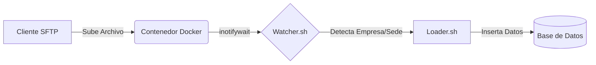

# 🐳 Servidor SFTP Dockerizado con Event Triggers


Una solución robusta y contenerizada para la ingesta de archivos mediante SFTP. Este sistema no solo actúa como un servidor de archivos seguro, sino que integra un sistema de **detección de eventos en tiempo real** para procesar datos automáticamente apenas son subidos.

---

## 🚀 Características Principales

*   **🔐 Multi-Tenant Seguro**: Aislamiento total de usuarios mediante `Chroot`. Cada empresa ve únicamente su directorio.
*   **👀 Watcher Inteligente**: Monitorización recursiva usando `inotify-tools`. Detecta eventos `close_write` para asegurar que el archivo se ha subido completamente.
*   **⚡ Trigger Automático**: Ejecución inmediata de scripts de carga (`loader.sh`) con inyección de metadatos (Empresa, Sede, Ruta).
*   **📂 Estructura Dinámica**: Creación automática de usuarios y directorios basada en variables de entorno.

---

## 🛠️ Arquitectura del Flujo

El sistema sigue el siguiente pipeline de ejecución:

1.  **Conexión**: El cliente conecta vía SFTP (Puerto 2222).
2.  **Upload**: Sube un archivo a `/upload/{Sede}/archivo.txt`.
3.  **Detección**: El proceso `watcher.sh` detecta el cierre de escritura del archivo.
4.  **Parsing**: Se extrae la **Empresa** (del usuario) y la **Sede** (del subdirectorio).
5.  **Ejecución**: Se invoca al script `loader.sh` con los argumentos estructurados.



---

## 📋 Requisitos Previos

*   Docker Engine
*   Docker Compose

---

## 🏎️ Inicio Rápido

### 1. Clonar el repositorio
```bash
git clone https://github.com/Kennethguerra3/ServidorSFTP.git
cd ServidorSFTP
```

### 2. Configurar Usuarios
Edita el archivo `docker-compose.yml` para definir los usuarios permitidos.
El formato es `USUARIO:CONTRASEÑA`. Separa múltiples usuarios con punto y coma (`;`).

```yaml
environment:
  - "SFTP_USERS=EmpresaA:password123;EmpresaB:segura456"
```

### 3. Desplegar
```bash
docker-compose up --build -d
```

---

## 🧪 Cómo Probar

1.  Conéctate mediante un cliente SFTP (FileZilla, WinSCP, Cyberduck):
    *   **Host**: `localhost`
    *   **Puerto**: `2222`
    *   **Usuario**: `EmpresaA`
    *   **Password**: `password123`

2.  Crea una carpeta con el nombre de una sede dentro de `upload`, por ejemplo `SedeCentral`.
3.  Sube un archivo de prueba en esa carpeta.
4.  Revisa los logs del contenedor para ver la magia:

```bash
docker logs -f sftp_integrator
```

Deberías ver una salida similar a:
```text
Detectado nuevo archivo: /home/EmpresaA/upload/SedeCentral/data.txt
 -> Empresa detectada: EmpresaA
 -> Sede detectada: SedeCentral
 -> Ejecutando trigger...
```

---

## ☁️ Despliegue en Railway (Recomendado)

Este proyecto está optimizado para funcionar nativamente en Railway.

[](https://railway.app/new/template?template=https://github.com/Kennethguerra3/ServidorSFTP&envs=SFTP_USERS)

### Método Manual (Paso a Paso)

1. **Nuevo Proyecto**: En Railway, selecciona "Deploy from GitHub repo" y elige este repositorio.
2. **Variables de Entorno (OBLIGATORIO)**:
    * El servicio NO arrancará correctamente sin usuarios definidos.
    * Ve a la pestaña **Variables** y añade:
        * `SFTP_USERS` = `EmpresaA:pass123;EmpresaB:pass456`
3. **Configurar Puertos (CRÍTICO)**:
    * **Paso A (Variable PORT)**:
        * Ve a **Variables** en Railway y agrega `PORT` = `22`.
        * *Explicación*: Esto le dice a Railway que el tráfico interno debe ir al puerto 22 (SSH).
    * **Paso B (TCP Proxy)**:
        * Por defecto, SFTP no usa HTTP. Necesitas un **TCP Proxy**.
        * Ve a **Settings** -> **Networking** -> **Public Networking**.
        * Haz clic en **TCP Proxy**.
        * Railway te asignará un dominio (ej. `roundhouse.proxy.rlwy.net`) y un puerto público (ej. `41092`).
        * **IMPORTANTE**: En FileZilla usa el puerto público (`41092` en este ejemplo), NO el 22.

### Cómo Conectar (Cliente SFTP)

**⚠️ ATENCIÓN: MUY IMPORTANTE**
Railway te da una dirección completa como `switchback.proxy.rlwy.net:42064`.
Para conectarte en FileZilla, debes **SEPARAR** los datos. **NO** pegues todo en el campo de servidor.

Sigue este ejemplo exacto:

* **Servidor/Host**: `switchback.proxy.rlwy.net` (Solo las letras)
* **Puerto**: `42064` (Solo los números del final)

| Dato | Valor (Ejemplo) | Notas |
| :--- | :--- | :--- |
| **Protocolo** | `SFTP` | Selecciona SFTP - SSH File Transfer Protocol |
| **Servidor** | `roundhouse.proxy.rlwy.net` | **SOLO** el dominio, sin el puerto dos puntos |
| **Puerto** | `41092` | El puerto numérico va en su propia casilla |
| **Usuario** | `EmpresaA` | El que definiste en Variables |
| **Contraseña** | `...` | La que definiste en Variables |

### 4. Guardar Archivos (Persistencia)

Si reinicias el servidor en Railway, los archivos subidos se borrarán si no configuras un "Volumen".

1. En Railway, haz clic en tu servicio.
2. Ve a la pestaña **Volumes**.
3. Haz clic en el botón **Add Volume** (o `+`).
4. Escribe `/home` donde dice "Mount Path".
5. Dale a guardar/Add. Railway reiniciará el servicio y ahora tus archivos estarán seguros.

---

## 🏠 Desarrollo Local (En tu PC)

Instrucciones para probarlo en tu computadora antes de subirlo:

1. Clonar el repositorio.
2. Editar `docker-compose.yml` si quieres cambiar usuarios de prueba.
3. Ejecutar:

    ```bash
    docker-compose up --build
    ```

4. Conectar usando `localhost` y puerto `2222`.

**Nota sobre Volúmenes en Local**:
El archivo `docker-compose.yml` ya tiene listo el volumen. Solo descomenta la línea que dice `- ./sftp_data:/home` si quieres ver los archivos en una carpeta de Windows.

---

## 🔧 Personalización Avanzada

### Usuarios y Permisos

Los usuarios se crean automáticamente al iniciar el contenedor basándose en la variable `SFTP_USERS`.

* Formato: `USER:PASS;USER2:PASS2`
* Cada usuario es "enjaulado" (Chroot) en `/home/{usuario}`.
* Se crea automáticamente una carpeta `/home/{usuario}/upload` con permisos de escritura.

### Integración de Scripts (El Trigger)

El sistema soporta dos modos de operación para ejecutar lógica cuando llega un archivo:

#### Opción A: Script Global (Por defecto)

Si usas el script que viene en el contenedor (`loader.sh`), este se ejecutará para todos los usuarios.

#### Opción B: Script Personalizado (Por Usuario)

Cada usuario puede subir su PROPIO script para ejecutar sus propias reglas.

1. Conecta por FileZilla con tu usuario.
2. Verás una carpeta llamada `scripts` (además de `upload`).
3. Sube tu script con el nombre exacto `loader.sh` dentro de esa carpeta `scripts`.
4. **¡Listo!** El sistema detectará automáticamente que existe ese archivo y lo usará ESE en lugar del global.

**Argumentos que recibe tu script:**
El sistema invocará tu script (sea global o personalizado) con estos argumentos:

```bash
./loader.sh --empresa="EmpresaA" --sede="SedeNorte" --file="/home/.../archivo.txt"
```

### Volumen de Persistencia
Si deseas conservar los archivos subidos tras reiniciar el contenedor, descomenta la línea de volúmenes en `docker-compose.yml`:

```yaml
    volumes:
      - ./sftp_data:/home
```

---

## 📜 Licencia

Este proyecto está bajo la Licencia MIT.
