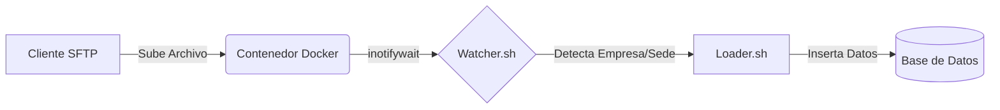

# 🐳 Servidor SFTP Dockerizado con Event Triggers


Una solución robusta y contenerizada para la ingesta de archivos mediante SFTP. Este sistema no solo actúa como un servidor de archivos seguro, sino que integra un sistema de **detección de eventos en tiempo real** para procesar datos automáticamente apenas son subidos.

---

## 🚀 Características Principales

*   **🔐 Multi-Tenant Seguro**: Aislamiento total de usuarios mediante `Chroot`. Cada empresa ve únicamente su directorio.
*   **👀 Watcher Inteligente**: Monitorización recursiva usando `inotify-tools`. Detecta eventos `close_write` para asegurar que el archivo se ha subido completamente.
*   **⚡ Trigger Automático**: Ejecución inmediata de scripts de carga (`loader.sh`) con inyección de metadatos (Empresa, Sede, Ruta).
*   **📂 Estructura Dinámica**: Creación automática de usuarios y directorios basada en variables de entorno.

---

## 🛠️ Arquitectura del Flujo

El sistema sigue el siguiente pipeline de ejecución:

1.  **Conexión**: El cliente conecta vía SFTP (Puerto 2222).
2.  **Upload**: Sube un archivo a `/upload/{Sede}/archivo.txt`.
3.  **Detección**: El proceso `watcher.sh` detecta el cierre de escritura del archivo.
4.  **Parsing**: Se extrae la **Empresa** (del usuario) y la **Sede** (del subdirectorio).
5.  **Ejecución**: Se invoca al script `loader.sh` con los argumentos estructurados.



---

## 📋 Requisitos Previos

*   Docker Engine
*   Docker Compose

---

## 🏎️ Inicio Rápido

### 1. Clonar el repositorio
```bash
git clone https://github.com/Kennethguerra3/ServidorSFTP.git
cd ServidorSFTP
```

### 2. Configurar Usuarios
Edita el archivo `docker-compose.yml` para definir los usuarios permitidos.
El formato es `USUARIO:CONTRASEÑA`. Separa múltiples usuarios con punto y coma (`;`).

```yaml
environment:
  - "SFTP_USERS=EmpresaA:password123;EmpresaB:segura456"
```

### 3. Desplegar
```bash
docker-compose up --build -d
```

---

## 🧪 Cómo Probar

1.  Conéctate mediante un cliente SFTP (FileZilla, WinSCP, Cyberduck):
    *   **Host**: `localhost`
    *   **Puerto**: `2222`
    *   **Usuario**: `EmpresaA`
    *   **Password**: `password123`

2.  Crea una carpeta con el nombre de una sede dentro de `upload`, por ejemplo `SedeCentral`.
3.  Sube un archivo de prueba en esa carpeta.
4.  Revisa los logs del contenedor para ver la magia:

```bash
docker logs -f sftp_integrator
```

Deberías ver una salida similar a:
```text
Detectado nuevo archivo: /home/EmpresaA/upload/SedeCentral/data.txt
 -> Empresa detectada: EmpresaA
 -> Sede detectada: SedeCentral
 -> Ejecutando trigger...
```

---

## ☁️ Despliegue en Railway

Este proyecto es totalmente compatible con Railway. Sigue estos pasos para configurarlo:

### 1. Variables de Entorno

En el panel de tu proyecto en Railway, ve a la pestaña **Variables** y agrega la siguiente clave:

* **Clave**: `SFTP_USERS`
* **Valor**: `EmpresaA:pass123;EmpresaB:pass456`

*(Asegúrate de no dejar espacios entre los usuarios).*

### 2. Networking (TCP Proxy)

El protocolo SFTP no funciona con dominios web normales (HTTP/HTTPS). Debes crear un Proxy TCP.

1. Ve a la pestaña **Settings** -> **Networking** (o directamente en la tarjeta del servicio).
2. Busca la sección "Public Networking".
3. Haz clic en **TCP Proxy**.
4. Railway te generará una dirección y un puerto, por ejemplo:
    * **Domain**: `roundhouse.proxy.rlwy.net`
    * **Port**: `54321`

### 3. Conexión

Usa esos datos en tu cliente SFTP:

* **Host**: `roundhouse.proxy.rlwy.net`
* **Puerto**: `54321` (El puerto que te dio el TCP Proxy, NO el 22 ni el 2222).
* **Usuario**: `EmpresaA`
* **Password**: `pass123`

---

## 🔧 Personalización

### Script de Carga (Loader)
El archivo `loader.sh` incluido es un **MOCK** para demostración.
Para producción:
1.  Reemplaza `loader.sh` con tu script real (Python, Bash, Node, etc.).
2.  Asegúrate de que tu script acepte los siguientes argumentos:
    *   `--empresa="NombreEmpresa"`
    *   `--sede="NombreSede"`
    *   `--file="/ruta/completa/archivo.ext"`

### Volumen de Persistencia
Si deseas conservar los archivos subidos tras reiniciar el contenedor, descomenta la línea de volúmenes en `docker-compose.yml`:

```yaml
    volumes:
      - ./sftp_data:/home
```

---

## 📜 Licencia

Este proyecto está bajo la Licencia MIT.
